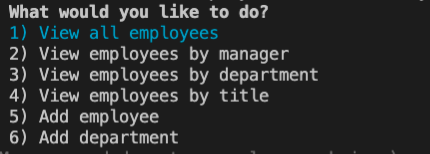
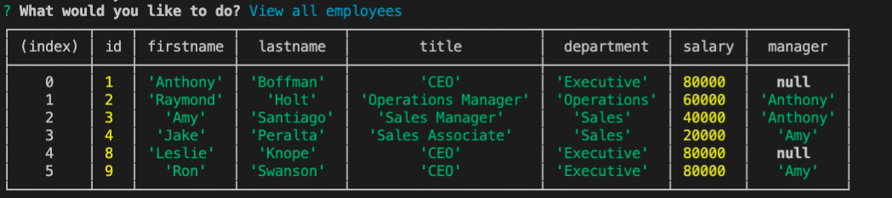

# employee-tracker
A command-line application that allows users to view and update employee information.
  
## Table of Contents
1. Installation
1. Usage
  
## Installation
This program uses inquirer to pguide the user with their options and mysql to establish a connection to the database. To install these modules, simply put "npm install" in your commandline/terminal.
  
  

## Usage
After installation, you can type "node index.js" in the command line and the program will begin. It will prompt you with what action you'd like to perform. 
 

  